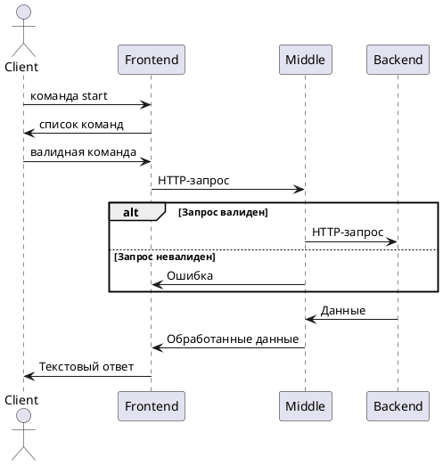

# Миддл сервис для lukina-telegram-bot

* Принимает запросы от tg-бота
* Выполняет валидацию и бизнес-логику
* Маршрутизирует запросы в backend

## Стек

Java

## Быстрый старт

```bash
./gradlew build
./gradlew bootRun
```

## Схема работы



## Автор
devmargooo@gmail.com

